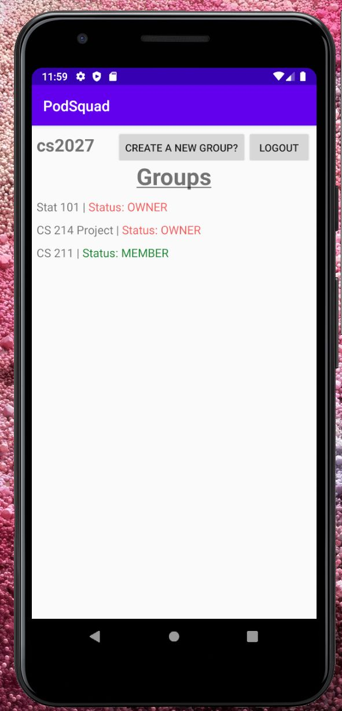
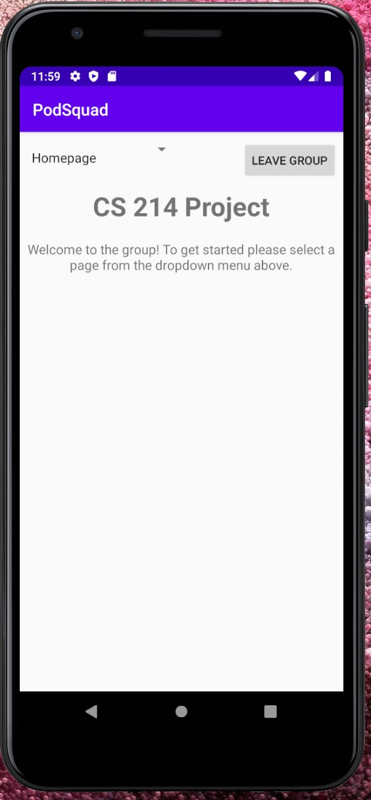
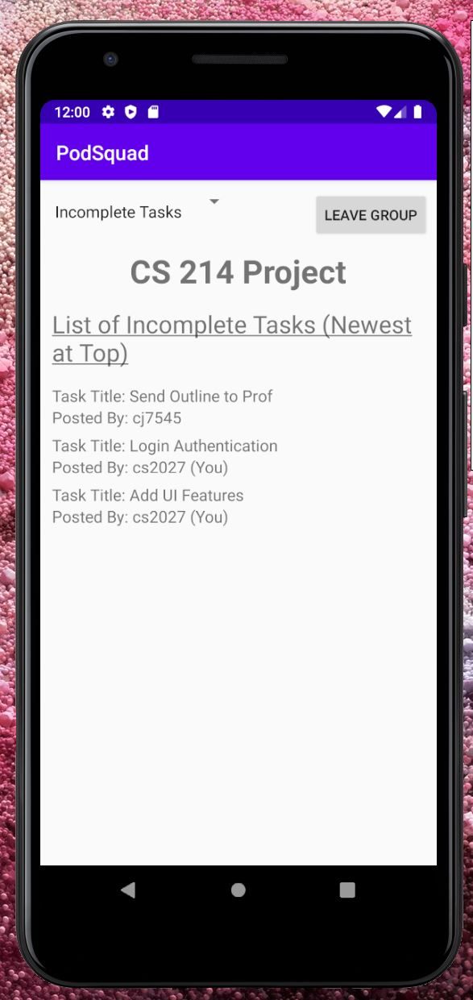
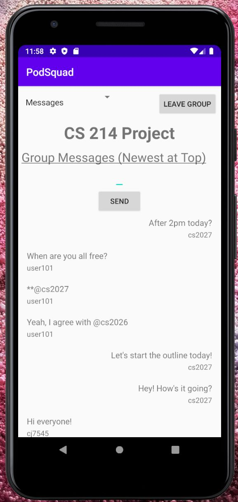

# PodSquad

## Description
PodSquad is an Android application written in Java that functions simultaneously as a group chat and a community to-do list. Using this app, you can create private groups with 
as many or as few members as you would like, as well as a custom group name that can be changed at any time. 

Within these groups, you can create tasks for the group to do and mark them as complete once they get finished. For example, say that you and 2 other classmates are writing an English paper together. One member can add a task "Create an outline for the paper", another can add "Finish intro paragraph", and the third member can add "Cite sources". And once each of these tasks is finished, any of the group members can mark the task as complete. It is also possible to mark completed tasks as incomplete in case you need to go back and change something, as well as edit the contents of the task itself. This could be useful in workplace settings, classrooms, families, event planning, or any scenario in which you need to coordinate with a group and manage multiple people.

Moreover, as is often the case in both small and large groups, you will need to communicate frequently with the other group members, and rather than using a separate platform just for group communication, PodSquad integrates group messages into the app as well, making groupwork seamless and efficient. Within a group, each member
can send messages back and forth with the other members in real time, providing instant communication and feedback between the different members, much like any other texting platform would. 

And finally, every individual's data is securely protected using the SHA-512 algorithm for password hashing to keep user data safe, making PodSquad a multi-purpose, simple, and secure app for almost anyone to use.

## UI Demonstration

### Initial Landing Page

------------------------------------------
### Group Homepage 

------------------------------------------
### To-Do List Items

------------------------------------------
### Group Chat/Messages

